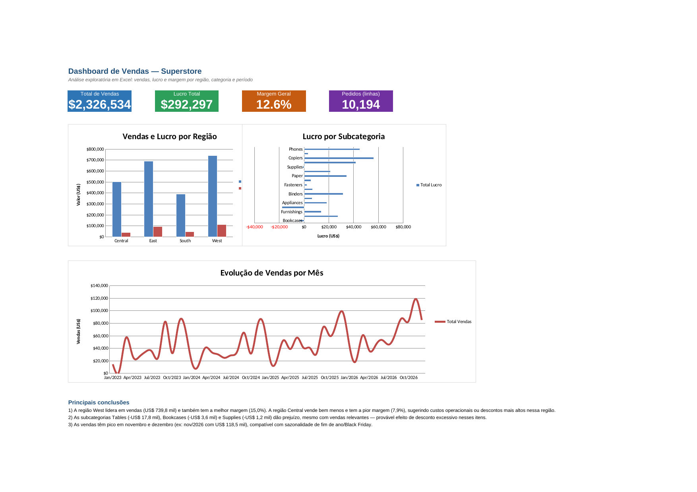

# Dashboard de Vendas — Superstore (Excel)

## Sobre o projeto
Análise exploratória de dados de vendas de uma rede varejista fictícia (dataset Superstore),
feita inteiramente em Excel: organização e limpeza de dados, tabelas-resumo com fórmulas,
gráficos e um dashboard final com KPIs e conclusões.

Projeto de portfólio, feito na transição da área jurídica para análise de dados.

## Dataset
- **Fonte:** Sample Superstore Dataset (dataset público amplamente usado para prática de BI/Excel)
- **10.194 registros | 21 colunas**
- **Período:** janeiro/2023 a dezembro/2026
- Sem valores nulos ou linhas duplicadas

## Perguntas respondidas
1. Qual região vende mais e qual tem a melhor margem de lucro?
2. Quais subcategorias de produto dão prejuízo (lucro negativo)?
3. Como as vendas evoluem mês a mês? Existe sazonalidade?

## Estrutura do arquivo (`superstore_analise.xlsx`)
| Aba | Conteúdo |
|---|---|
| `Dados` | Base completa, formatada como Tabela do Excel, com colunas auxiliares de Mês/Ano e Margem % |
| `Resumo_Regiao` | Vendas, lucro e margem por região (fórmulas `SOMASE`/`SUMIFS`) |
| `Resumo_Categoria` | Vendas e lucro por categoria/subcategoria, com destaque condicional em vermelho para lucro negativo |
| `Resumo_Mes` | Vendas totais por mês, usada no gráfico de evolução temporal |
| `Dashboard` | KPIs, 3 gráficos e conclusões da análise |

Todas as tabelas-resumo usam fórmulas (não valores fixos) — se a base de dados mudar, tudo recalcula automaticamente.

## Ferramentas e técnicas
Excel — Tabela estruturada, `SOMASE`/`SUMIFS`, formatação condicional, gráficos de coluna/barra/linha, dashboard com KPIs.

## Dashboard

## Principais conclusões
1. A região **West** lidera em vendas (US$ 739,8 mil) e também tem a melhor margem (15,0%). A região **Central** vende bem menos e tem a pior margem (7,9%), sugerindo custos operacionais ou descontos mais altos por lá.
2. As subcategorias **Tables** (-US$ 17,8 mil), **Bookcases** (-US$ 3,6 mil) e **Supplies** (-US$ 1,2 mil) dão prejuízo mesmo com vendas relevantes — provável efeito de desconto excessivo nesses itens.
3. As vendas têm pico em **novembro e dezembro** (ex: nov/2026 com US$ 118,5 mil), compatível com sazonalidade de fim de ano/Black Friday.
